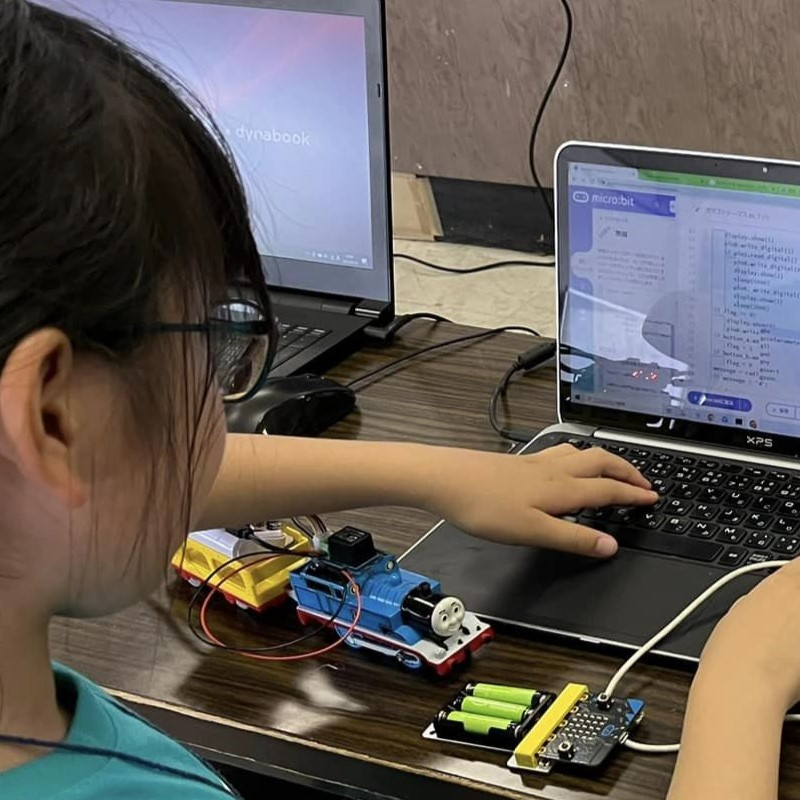
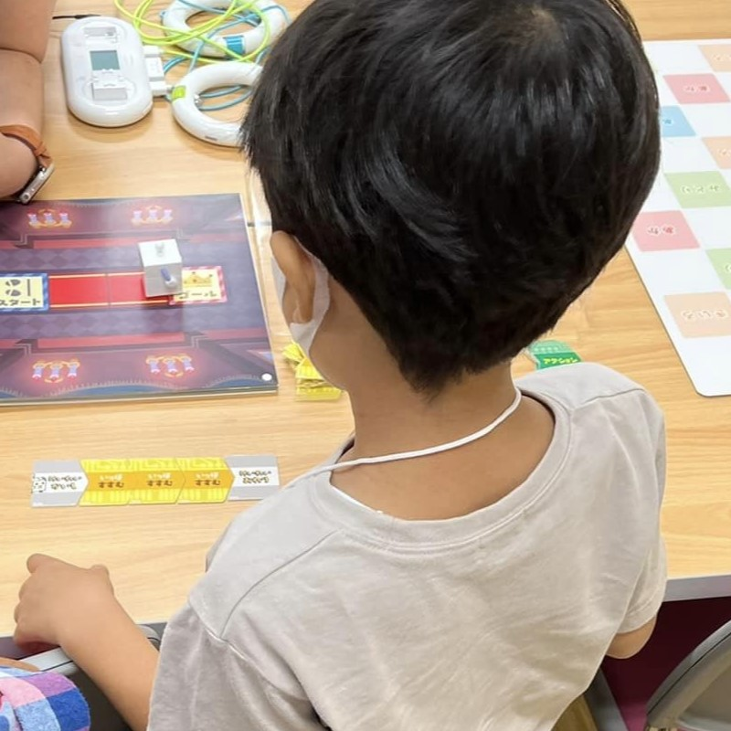
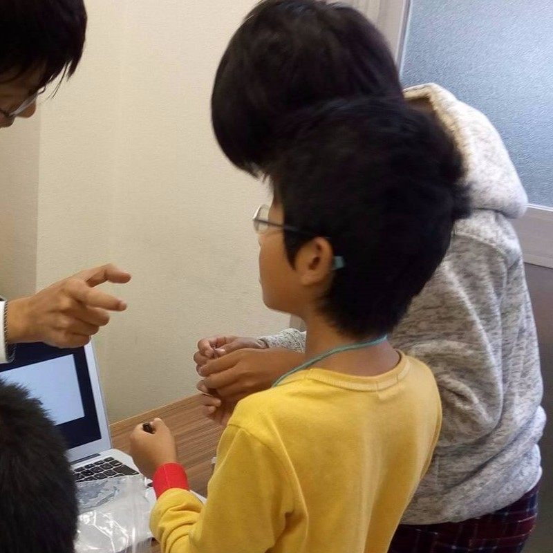
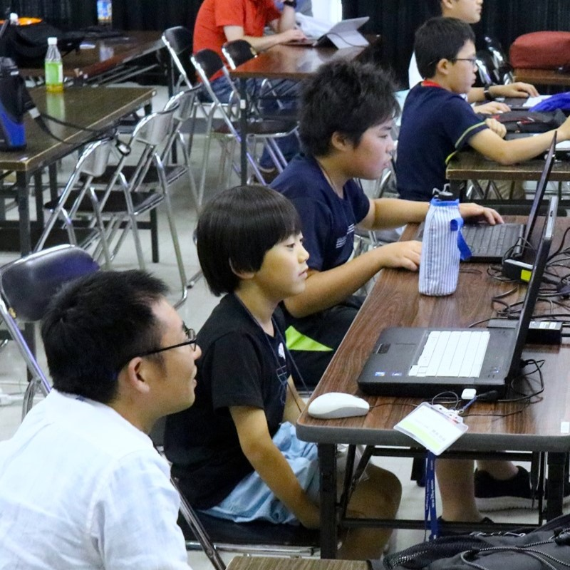

<section class="top">
 

    

      

        
2024.09.15 OKAYAMA

        
CoderDojoコミュニティのカンファレンスイベント

        

          
DojoCon Japanとは日本の CoderDojo コミュニティメンバーが全国から集まる、年に1度のカンファレンスイベント(CoderDojo Conference) です。

          
2016年に始まり、2024年は岡山市にて開催します。

        

        
Dream Up!

      

    

  

  

    <iframe class="video " src="https://player.vimeo.com/video/984275409?background=1" frameborder="0" allow="autoplay; fullscreen" allowfullscreen></iframe>
  

</section>

<!-- CoderDojoについて -->
<section id="about-coderdojo" class="aboutcoderdojo">
  

    

   <hgroup>
      <h2 class="aboutcoderdojo-headline-en">About CoderDojo</h2>
      <h3 class="aboutcoderdojo-headline-jp">CoderDojoとは</h3>
    </hgroup>
    
    
子ども達にプログラミングを学ぶ場を提供する、ボランティア主導の世界的な非営利活動です。

    
CoderDojo は2011年にアイルランドから始まり、現在は世界100カ国に2,000以上の道場があり、日本国内でも全国215以上の道場で毎年1,000回以上 (*1) 開催されています。CoderDojo はエンジニアやデザイナー、各地域の保護者や学生、研究者や経営者など（メンター）と子どもが出会える場にもなっています。

    
<small>*1 統計情報:<a href="https://coderdojo.jp/stats" target="_blank">https://coderdojo.jp/stats</a></small>

    

  

  

    

      

        

          
        

        

          
        

        

          
        

        

          
        

      

    

  

</section>

<!-- DojoConについて -->
<section class="aboutdojocon">
  

    

      

        

          

            <h3>DojoCon Japan 2024について</h3>
            <h4>テーマ：「Dream Up!」</h4>
            
2016から始まったDojoCon Japanも数えること今回で9回を迎えます。

            
今年のDojoCon Japanは、チャンピオン、メンターのお祭りに終わらせず、ワークショップ、セッションを通してCoderDojoコミュニティに繋がる人の 「夢」 を大切にしたいと考えています。 
            また、CoderDojoに関わっている人だけでなく、「関わりたいと思っている」人の為にも参加していただきたいです。

            
<strong>「Dream Up!」</strong> には、「新たなアイデアや計画を思いつく、または創造する」という意味があり、独創的な「夢」を実現するという意味も込めました。 
            DojoCon Japan2024が参加者のみなさんがそれぞれの 「夢」 を 「見つけ」 て、その先の 「実現」 に繋げていただくきっかけになればと考えています。

          

        

      

    

  

</section>

<!-- 開催概要 -->
<section id="overview">
  

    

      

        
<strong>OVERCVIEW</strong>

        <h2 class="my-1">開催概要</h2>
      

      

        

          

            
日　時

          

          

            
<strong>2024年9月15日(日)</strong>

          

        

        

          

            
会　場

          

          

            
<strong>杜の街グレース</strong>

            
岡山県岡山市北区下石井二丁目10番8号 [<a href="https://www.morinomachi-grace.jp/access/" target="_blank">アクセス詳細</a>] 

          

        

        

          

            
参加費

          

          

            
無　料

          

        

        

          

            
対　象

          

          

            
どなたでも

          

        

      

    

  

  

    <iframe src="https://www.google.com/maps/embed?pb=!1m14!1m8!1m3!1d4026.342453255084!2d133.91436685593482!3d34.66075094690766!3m2!1i1024!2i768!4f13.1!3m3!1m2!1s0x355407b1a01ee73f%3A0x9e34e4af1072de1d!2z44CSNzAwLTA5MDcg5bKh5bGx55yM5bKh5bGx5biC5YyX5Yy65LiL55-z5LqV77yS5LiB55uu77yR77yQ4oiS77yR77yQ!5e0!3m2!1sja!2sjp!4v1720245692149!5m2!1sja!2sjp" allowfullscreen="" loading="lazy" referrerpolicy="no-referrer-when-downgrade"></iframe>
  

</section>

<!-- お知らせ -->
<section id="news" class="container py-5">
  

    

      

        
<strong>NEWS</strong>

        <h2 class="my-1">お知らせ</h2>
      

      

          
            
          
      

    

  

  

    
     
    <a href="/news" class="btn btn-danger btn-lg mt-3">お知らせをもっと見る</a>
  

</section>

<!-- Youtube -->
<section id="live" class="bg-gray200">
  

    

      
<strong>COUNTDOWN DOJOCON JAPAN</strong>

      <h2 class="my-1">ライブ配信</h2>
      
DojoCon Japan 2024 の内容を紹介するライブ配信です。

    

    

      
        

          

            <iframe width="100%" height="250" src="https://www.youtube-nocookie.com/embed/{{ cd.id}}" frameborder="0" allow="accelerometer; autoplay; clipboard-write; encrypted-media; gyroscope; picture-in-picture" allowfullscreen></iframe>
            
{{ cd.title }} {{ cd.date }} ONAIR

          

        

      
   

  

</section>

<!-- お問合せ -->
<section id="contact" class="bg-blue text-color-white">
  

    

      
<strong>CONTACT</strong>

      <h2 class="my-1">お問合せ</h2>
      
DojoCon Japan {{ site.year }} についてのお問い合わせは以下のリンク先（Googleフォーム）よりお願いいたします。

    <a href="{{ site.contact }}" class="btn btn-outline-light btn-lg mt-3" target="_blank" rel="noopener">お問い合わせする</a>
    

  

</section>

<!-- スポンサー -->






<section id="sponsors" class="py-5">

  <h2 class="text-center title-text">SPONSORS</h2>

  
    

      <h3 class="text-center caption">Platinum Sponsor</h3>
      

        

        
          
        
        

      

    

  

  
    

      <h3 class="text-center caption">Gold Sponsor</h3>
      

        

        
          
        
        

      

    

  

  
    

      <h3 class="text-center caption">Silver Sponsor</h3>
      

        

        
          
        
        

      

    

  

  
    

      <h3 class="text-center caption">Bronze Sponsor</h3>
      

        

        
          
        
        

      

    

  

  
    

      <h3 class="text-center caption">In-kind Sponsor</h3>
      

        

        
          

            
            
{{ sponsor.message }}

          

        
        

      

    

  

  
    

      <h3 class="text-center caption">Individual Sponsor</h3>
      

        

        
          

            
            <a href="{{ sponsor.link }}" target='_blank' rel='noopener' style='text-decoration: underline;'>
            
              {{ sponsor.name }}
            
            </a>
            
          

        
        

      

    

  

</section>

<!-- スタッフ -->
<section id="staff" class="staff">
    

        

          
<strong>Organized by</strong>

          <h2 class="my-1">DojoCon Japan {{ site.year }} 実行委員会 <a href="https://coderdojo.jp/" target="_blank" rel="noopener">一般社団法人 CoderDojo Japan</a></h2>
        

        

            
            
            
        

   

    

        <h3 class="text-center">STAFF</h3>
        <ul class="staff-list">
         
           
           <li class="member {{ random_class }}">
           
           <a href="{{ member.site }}" target="_blank" rel="noopener">
           
           

             
             
             
           

           
{{ member.name }}
</a>
         </li>
         
        </ul>
    

    
</section>

<section>
  <h2 class="text-center title-text">Supported by</h2>
  
後援

  
<a href="https://coderdojo.com/" target="_blank" rel="noopener">CoderDojo Foundation</a>

</section>
